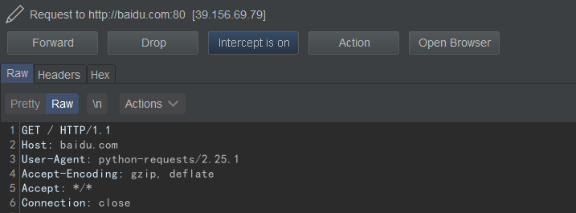

```python
import requests

resp = requests.get(url="http://baidu.com/")
print(resp.content) # b'<html>\n<meta http-equiv="refresh" content="0;url=http://www.baidu.com/">\n</html>\n'
```

## 发送请求
### 代理
```python
import requests

proxies = {
  "http": "http://127.0.0.1:8080/",
  "https": "http://127.0.0.1:8080/",
}
resp = requests.get(url="http://baidu.com/", proxies=proxies)
print(resp.text)
```

这样方便抓包测试



### GET

直接在url里传参数:
```python
resp = requests.get(url="http://127.0.0.1/?a=1&b=2")
```
通过params参数传参
```python
params = {
    'a':'1',
    'b':'2'
}
resp = requests.get(url="http://127.0.0.1/",params=params)
```

GET参数编码问题:
```python
resp = requests.get(
    url="http://127.0.0.1/", 
    params={'test':'1%2b1'},
    proxies=proxies)
print(resp.text)
```
上面的抓包发现又把%2b编码了一遍:
```
GET /?test=1%252b1 HTTP/1.1
Host: 127.0.0.1
User-Agent: python-requests/2.25.1
Accept-Encoding: gzip, deflate
Accept: */*
Connection: close

```
最后传过去的是`1%2b1`, 本意是传`1+1`

> 用在不可见字符,必须要用url编码表示的.

```
array(1) {
  ["test"]=>
  string(5) "1%2b1"
}
```

可以直接使用十六进制`\x2b`
```
resp = requests.get(
    url="http://127.0.0.1/", 
    params={'test':'1\x2b1'},
    proxies=proxies)
print(resp.text)
```
```
array(1) {
  ["test"]=>
  string(3) "1+1"
}
```
也可以先urldecode一下
```
import requests
import urllib.parse

resp = requests.get(
    url="http://127.0.0.1/", 
    params={'test':urllib.parse.unquote('1%2b1')},
    )
print(resp.text)
```
```
array(1) {
  ["test"]=>
  string(3) "1+1"
}
```

### POST

#### 简单使用
```python
import requests

proxies = {
  "http": "http://127.0.0.1:8080/",
  "https": "http://127.0.0.1:8080/",
}

data = {
    'a':'1',
    'b':'2'
}
resp = requests.post(url="http://127.0.0.1/",data=data, proxies=proxies)
print(resp.text)
```
这样默认`Content-Type: application/x-www-form-urlencoded`
```
POST / HTTP/1.1
Host: 127.0.0.1
User-Agent: python-requests/2.25.1
Accept-Encoding: gzip, deflate
Accept: */*
Connection: close
Content-Length: 7
Content-Type: application/x-www-form-urlencoded

a=1&b=2
```
#### 发送json格式数据
```
json = {
    'a':'1',
    'b':'2'
}
resp = requests.post(url="http://127.0.0.1/", json=json, proxies=proxies)
```
```
POST / HTTP/1.1
Host: 127.0.0.1
User-Agent: python-requests/2.25.1
Accept-Encoding: gzip, deflate
Accept: */*
Connection: close
Content-Length: 20
Content-Type: application/json

{"a": "1", "b": "2"}
```

#### XML
```python
xml = '''<?xml version="1.0" encoding="ISO-8859-1"?>
<!--  Copyright w3school.com.cn -->
<note>
    <to>George</to>
    <from>John</from>
    <heading>Reminder</heading>
    <body>Don't forget the meeting!</body>
</note>'''

headers={"Content-Type":"text/xml; charset=UTF-8"}
resp = requests.post(url="http://127.0.0.1/",headers=headers, data=xml, proxies=proxies)
```

需要通过headers设置Content-Type

Content-Type对照表: https://tool.oschina.net/commons/

```
POST / HTTP/1.1
Host: 127.0.0.1
User-Agent: python-requests/2.25.1
Accept-Encoding: gzip, deflate
Accept: */*
Connection: close
Content-Type: text/xml; charset=UTF-8
Content-Length: 211

<?xml version="1.0" encoding="ISO-8859-1"?>
<!--  Copyright w3school.com.cn -->
<note>
    <to>George</to>
    <from>John</from>
    <heading>Reminder</heading>
    <body>Don't forget the meeting!</body>
</note>
```

#### 文件表单
上传单个文件:

```
file = {'file': open('flag.txt', 'r')}
requests.post(url="http://127.0.0.1/",files=file)
```

```
POST / HTTP/1.1
Host: 127.0.0.1
User-Agent: python-requests/2.25.1
Accept-Encoding: gzip, deflate
Accept: */*
Connection: close
Content-Length: 162
Content-Type: multipart/form-data; boundary=bceb3dda7973faf6f1f209a1631cc12c

--bceb3dda7973faf6f1f209a1631cc12c
Content-Disposition: form-data; name="file"; filename="flag.txt"

flag{test_hhhhhhh}
--bceb3dda7973faf6f1f209a1631cc12c--

```

也可以手动设置Content-Type:
```
file = {'file': ('test.png', open('flag.txt', 'r'), 'image/png', {'Expires': '0'})}
requests.post(url="http://127.0.0.1/",files=file, proxies=proxies)
```

```
POST / HTTP/1.1
Host: 127.0.0.1
User-Agent: python-requests/2.25.1
Accept-Encoding: gzip, deflate
Accept: */*
Connection: close
Content-Length: 199
Content-Type: multipart/form-data; boundary=cbd8b58336488a3108ee02688f494b7f

--cbd8b58336488a3108ee02688f494b7f
Content-Disposition: form-data; name="file"; filename="test.png"
Content-Type: image/png
Expires: 0

flag{test_hhhhhhh}
--cbd8b58336488a3108ee02688f494b7f--

```

PHP_SESSION_UPLOAD_PROGRESS利用:
```
#encoding=utf-8
import requests
import io

url="http://127.0.0.1/"
f = io.BytesIO(b'a' * 1024 * 50)
answer = requests.post(
    url=url,
    data={'PHP_SESSION_UPLOAD_PROGRESS': '123456789'}, # !
    files={'file': ('test.txt', f)}, 
    params={'username': 'test', 'password': 'test'},
    cookies={"PHPSESSID": "test"} # ! PHPSESSID
    )
print(answer.content)
```

```
POST /?username=test&password=test HTTP/1.1
Host: 127.0.0.1
User-Agent: python-requests/2.25.1
Accept-Encoding: gzip, deflate
Accept: */*
Connection: close
Cookie: PHPSESSID=test
Content-Length: 311
Content-Type: multipart/form-data; boundary=569ce6274e341b0caaa951ca79a109f6

--569ce6274e341b0caaa951ca79a109f6
Content-Disposition: form-data; name="PHP_SESSION_UPLOAD_PROGRESS"

123456789
--569ce6274e341b0caaa951ca79a109f6
Content-Disposition: form-data; name="file"; filename="test.txt"

aaaaaaaaaaaaaaaaaaaaaaaaaaaaaaaaaaaaaaaaaaaaaaaaaa
...
--569ce6274e341b0caaa951ca79a109f6--

```

